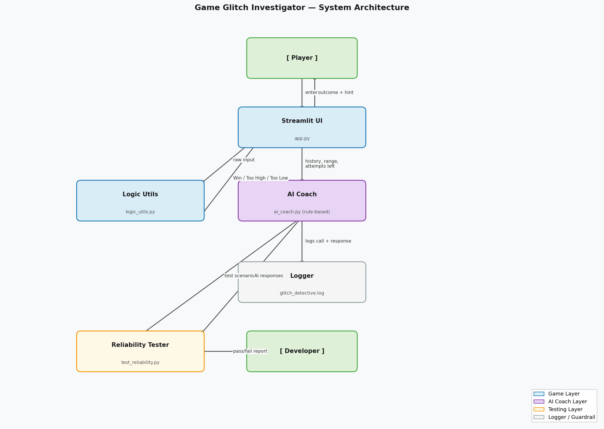

# Game Glitch Investigator — Applied AI System

## Original Project

This project is an extension of **Game Glitch Investigator**, which was developed in Module 1. In the original project, there is a broken number-guessing game written using Streamlit. The task was to identify and debug the game's issues, such as misleading hints, incorrect scores, and faulty state management. Following debugging, we can assess how AI can help us in our endeavors.

---

## What This Project Does

**Game Glitch Investigator: AI Coach** integrates an AI coach that provides guidance after each guess made by the user. Based on the user’s past guesses, the **Glitch Detective** determines the type of strategy the user has employed (binary search, random guessing, or incrementing/decrementing by small values) and gives the user feedback.

---

## How It's Organized

The system has three layers:

- **Game Layer** (`app.py` + `logic_utils.py`): Handles input, game state, scoring, and win/loss logic. No AI here.
- **AI Coach Layer** (`ai_coach.py`): After each valid guess, analyzes the guess history using rule-based pattern detection and returns a coaching tip. Every call is logged to `glitch_detective.log`.
- **Testing Layer** (`tests/test_reliability.py`): Runs the AI coach through scripted scenarios and checks that responses are valid.



---

## Setup

### 1. Clone the repo

```bash
git clone https://github.com/hspb2024/applied-ai-system-project.git
cd applied-ai-system-project
```

### 2. Create a virtual environment (recommended)

```bash
python -m venv venv
source venv/bin/activate       # Linux
venv\Scripts\activate          # Windows
```

### 3. Install dependencies

```bash
pip install -r requirements.txt
```

### 4. Run the app

```bash
streamlit run app.py
```

### 5. (optional) If you want to run unit tests

```bash
pytest tests/test_game_logic.py
```

### 6. (optional) If you want to run AI reliability tests 

```bash
python tests/test_reliability.py
```

---

## Sample Interactions

**Example 1 — Random guesser**
Guesses: `[10, 90, 33, 77]` | Range: 1–100 | 4 attempts left

> "It looks like your guesses are all over the place. Consider taking a more systematic approach. Select the midpoint of the current range and divide the range into two each time. Since you have four tries remaining, you have to make each one count."

---

**Example 2 — Small stepper**
Guesses: `[10, 11, 12, 13]` | Range: 1–100 | 4 attempts left

> "You are making too many small steps within the range of 1 to 100. At four tries remaining, you need to take at least 12 steps per guess. Take bigger steps, or you won't be able to do this in time."

---

**Example 3 — Good binary search**
Guesses: `[50, 75, 62]` | Range: 1–100 | 5 attempts left

> "You are employing the use of binary search, which is the optimal solution for this scenario! You have five tries remaining; just continue dividing the current range in half."

---

## Design Decisions

**Why rule-based AI instead of a language model API?**
The coaching task is pattern recognition — detecting binary search, random guessing, or small steps. That doesn't require a language model. A rule-based system does it reliably, instantly, and with no API cost or dependency. It also runs offline.

**Why keep game logic and AI coach separate?**
`logic_utils.py` handles deterministic game logic (win/loss/score) while `ai_coach.py` handles strategy analysis. Keeping them separate means the game works even if the coach breaks, and each piece can be tested independently.

**Trade-offs**
- Rule-based hints are deterministic — the same input always produces the same output. This makes testing easier but means the coach can't handle unusual patterns it wasn't designed for.
- A language model would handle edge cases more flexibly, but adds cost, latency, and an external dependency.

---

## Testing Summary

**Unit tests:** 18 tests across `test_game_logic.py` — all pass. Covers input parsing, difficulty ranges, guess outcomes, and scoring.

**Reliability tests:** 5 test cases are sent to the AI coach (binary search engine, random guesser, small-step solver, single guesser, easy level mode). Verified for: presence of output, logical output length, absence of error messages in plain text. All 5 succeeded. Since the coach operates on a set of predefined rules without any dependencies, it works flawlessly each time.

---

## Ethics and Critical Reflection

**What are the limitations or biases in your system?**

The Glitch Detective is limited to four types of strategies. Anything that doesn’t fit the four receives the same general guidance. The criteria values for recognition were manually defined, and thus not universal to all difficulties. Moreover, there’s a clear bias toward binary search, which the AI suggests every time, regardless of whether another strategy could make the experience more fun.

**Could your AI be misused, and how would you prevent that?**

In the context of the game, there is no danger of misusing our AI. However, the log file stores guess history, so we had to take precautions. First, we made sure not to store any data that would identify a particular user. Second, our rule-based system is perfectly transparent, making auditing relatively easy.

**What surprised you during reliability testing?**

Initially, the random guesser behavior was classified as the binary search because the values of steps were above the chosen thresholds. To fix the error, new criteria had to be implemented. This particular problem showed that even simple systems require checking for edge cases besides happy paths.

**Collaboration with AI during this project**

Claude Code has been utilized in all stages of code writing, error correction, and project organization. One of the useful suggestions made by Claude is to separate the game logic and the AI coach to ensure the former functions properly despite any issues with the latter. A wrong suggestion is the use of an initial detection strategy for guesses which incorrectly classified some guessing patterns, but identifying and correcting the bug made testing worthwhile.
